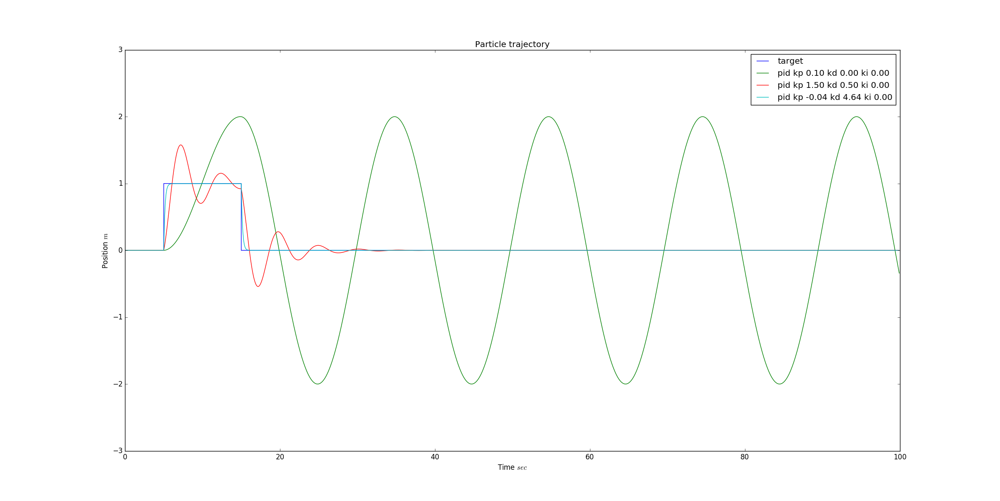
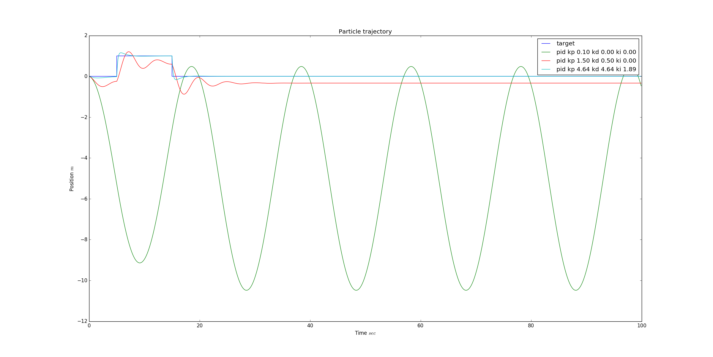

**py-control**,

a Python playground to experiment with [PID controllers](https://en.wikipedia.org/wiki/PID_controller). In particular the effects of individual PID terms can be observed in a scenario where a n-dimensional particle, driven by forces, needs to be controlled.

In [particle_trajectory.py](particle_trajectory.py) a one-dimensional particle is asked to to follow a trajectory that changes over time. In particular the trajectory represents a sharp step function. It is assumed that the particle position cannot be directly controlled, but rather the PID controller can compute a force that is being applied to the particle. Over time these forces are then integrated to velocities and particle position.

The image below illustrates the effects of different PID parameters on the particle's trajectory. In blue the target trajectory. Green shows a P-controller, red a PD-controller and a trajectory of an auto-tuned particle is shown in mint. 



Note how the proportional controller overshoots (it basically accelerates all the way until it recognizes it's too late). The dynamic process is implement by inheriting from `ctrl.Process` and providing the necessary methods.

```Python
class MoveParticleProcess(ctrl.Process):
    """Models a dynamic system in which a particle driven by forces follows a desired trajectory. """

    def __init__(self, particle=ctrl.Particle(), pid=ctrl.PID()):
        super(MoveParticleProcess, self).__init__()
        self.particle = particle
        self.pid = pid

    def target(self, t):
        """Return setpoint position for particle to reach.
        Simple step function at t == 1. and t==15.
        """
        if t < 5. or t >= 15.:
            return np.asarray([0.])
        else:
            return np.array([1.])
    
    def sense(self, t):
        """Sense particle position."""
        return self.particle.x
    
    def correct(self, error, dt):
        """Compute correction based on error."""
        return self.pid.update(error, dt)

    def actuate(self, u, dt):
        """Update particle position. 
        Takes the correction value `u` and interprets it as force acting on the particle, 
        then upates the motion equations by `dt`.
        """
        self.particle.add_force(u)
        self.particle.update(dt)
```

You can then run the simulation by 

```Python
process = MoveParticleProcess(
    particle=ctrl.Particle(x0=[0], v0=[0], inv_mass=1.), 
    pid=ctrl.PID(kp=0.1, ki=0.0, kd=1.0)
)
result = process.loop(tsim=100, dt=0.1)

plt.plot(result['t'], result['x']) # Plot trajectory over time
```

You may want to experiment with different processes yourself. For example, by additing external forces to the `MoveParticleProcess`

```Python
def actuate(self, u, dt):
    """Update particle position. """
    self.particle.add_force(u)
    self.particle.add_force(np.array([-0.5 * self.particle.mass]))
    self.particle.update(dt)
```

you will notice that only a PID controller that includes an integral term can follow the trajectory smoothly.


